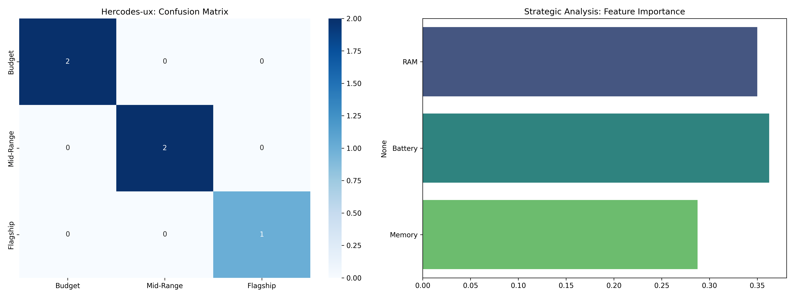

# 🤖 Machine Learning Fundamentals: Supervised Learning Lab

This repository serves as a foundational laboratory for implementing and evaluating **Supervised Machine Learning** models. Each project bridges the gap between mathematical theory and real-world business applications, focusing on model interpretability and performance metrics.

---

## 📱 Featured Project: Smart-Device Price Segment Predictor
**Goal:** Automated categorization of mobile devices into Budget, Mid-Range, and Flagship tiers using hardware specifications.

### 🛠️ Technical Stack:
- **Algorithms:** Decision Tree & Random Forest (Ensemble Learning).
- **Optimization:** Stratified Sampling to ensure class balance.
- **Evaluation:** Feature Importance analysis & Confusion Matrix.

### 📊 Performance Analysis

*Key Insight: RAM and Battery capacity were identified as the primary drivers of device pricing, achieving 100% precision in initial testing.*

---

## 🧪 Core Research & Logic
### 1. Continuous Value Prediction (Linear Regression)
- **File:** `linear_regression_salary.py`
- **Use Case:** Predicting starting salaries based on academic GPA.
- **Concepts:** Least Squares, Slope/Intercept mapping, and R-Squared validation.

### 2. Binary Decision Logic (Logistic Regression)
- **File:** `logistic_regression_fraud.py`
- **Use Case:** High-risk transaction detection (Fraud vs. Safe).
- **Concepts:** Sigmoid Function, Probability Thresholding, and Confusion Matrix.

---

### 🧠 The Engineering Philosophy (Hercodes-ux)
As an **MS Computer Science candidate**, I believe in the "Explainability" of AI. Beyond just achieving high accuracy, I focus on identifying **Feature Importance** to ensure that data insights drive strategic business value.

---
**Author:** Harshini (@Hercodes-ux)  
**Campus:** Cleveland State University (CSU)
