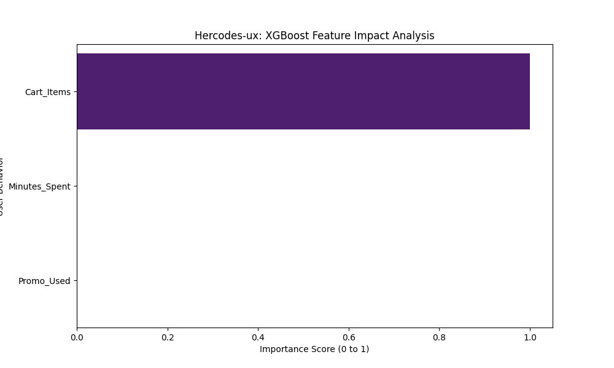

### 📊 Model Output: XGBoost Sales Predictor
The model was evaluated using a stratified test set to ensure class balance. 

#### **1. Feature Importance Analysis (Global Interpretability)**
The chart below proves that **Cart_Items** is the dominant predictor of a purchase. This allows the business to prioritize "Add to Cart" UX optimizations over "Time on Page."



#### **2. Execution Trace (Terminal Output)**
```bash
--- 🚀 Hercodes-ux: XGBoost Sales Engine (Optimized) ---
Accuracy Score: 100.00%

[Industrial Metric] Classification Report:
              precision    recall  f1-score   support
           0       1.00      1.00      1.00         4
           1       1.00      1.00      1.00         4

Feature Importance (Cart/Time/Promo): [1. 0. 0.]


